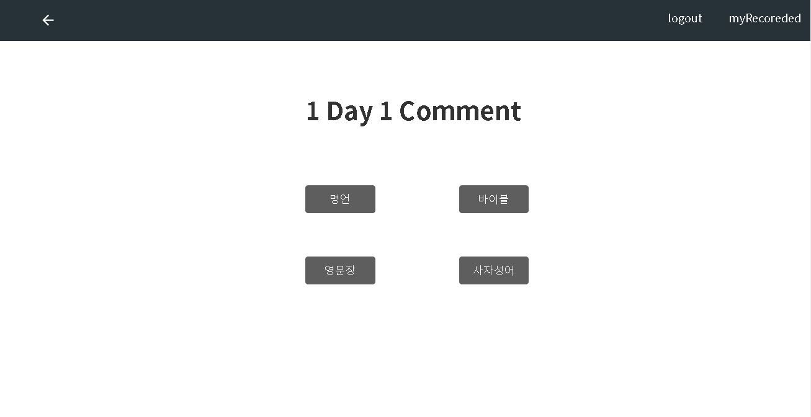
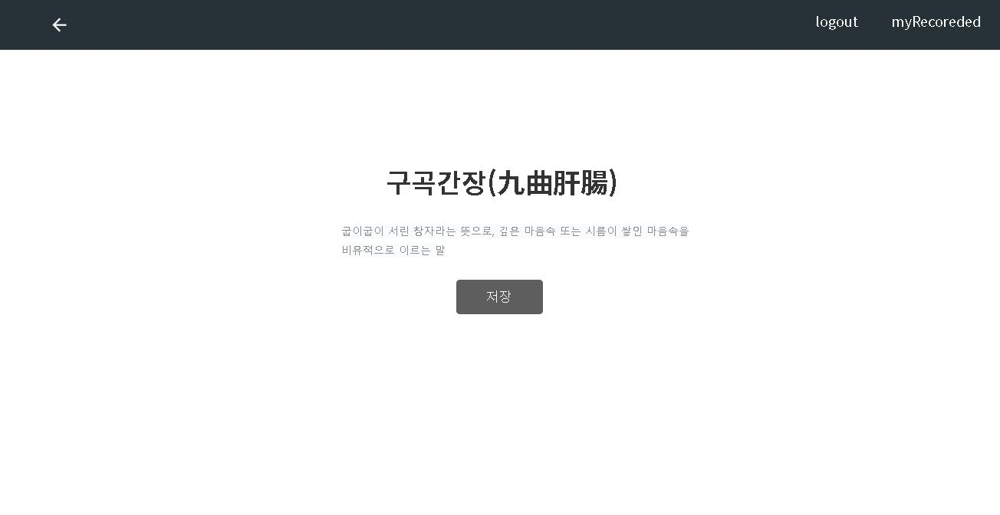
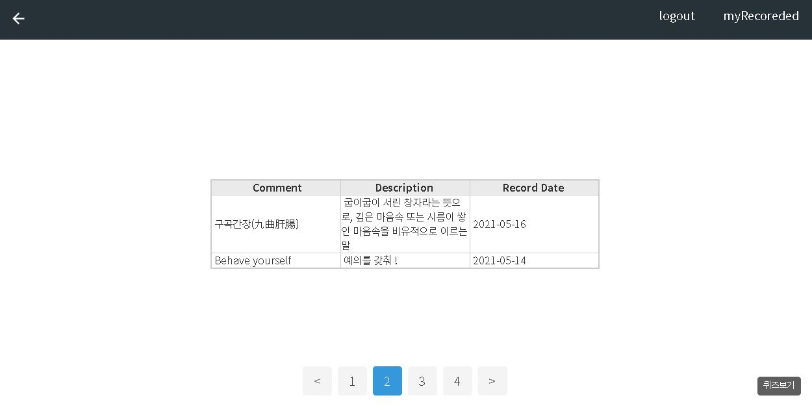
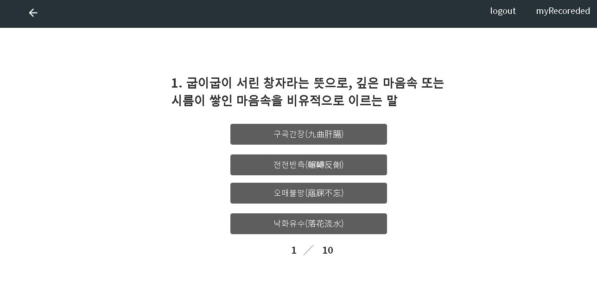

# OneDayOneComment

### 목적

---

*하나씩 차곡차곡 익혀두어 명언, 바이블, 영문장, 사자성어 분야에서의 박사가 되어보자*

### 기능

---

- 1일 1명언
- 1일 1바이블
- 1일 1영문장
- 1일 1사자성어
- 하루에 하나씩 명언, 바이블, 영문장, 사자성어 중에 선택해서 익혀둔다
- 명언, 바이블, 영문장, 사자성어를 등록할 수도 있다
- 사용자별로 오늘 익힌 부분에 대해 메모 해놓을 수 있는 메모(기록)함 제공
- 메모(기록)함에 담겨있는 지식으로 퀴즈를 볼 수도 있다

### UI

---

**시작화면**

**명언, 바이블, 영단어, 사자성어 소개 화면**

**기록함 화면**

**퀴즈 화면**

